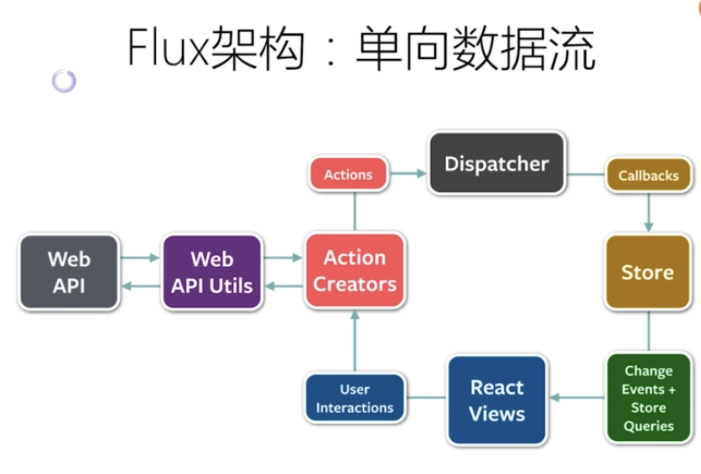
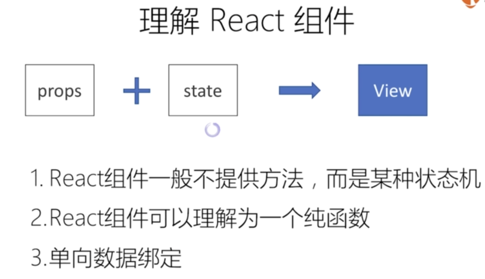
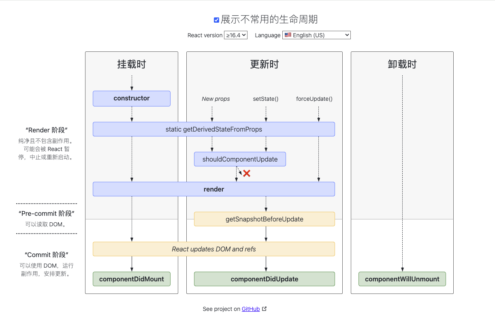
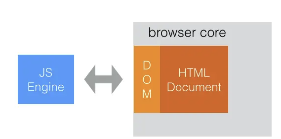
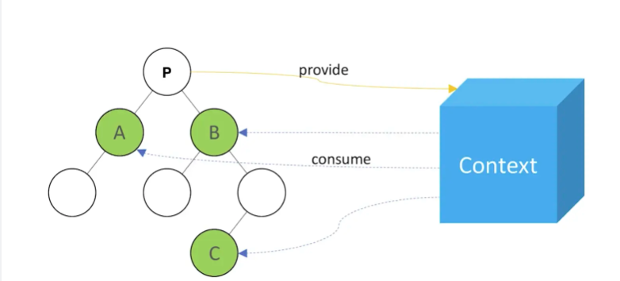

# react

## 代码展示

通过 codesandbox.io 您可以在线修改演示代码尝试运行结果，无需本地部署

## Flux 架构及其主要特点

Flux 是一种构建用户界面的架构设计模式。Flux的核心思想就是数据和逻辑永远单向流动。

Redux 是一个使用叫做“action”的事件来管理和更新应用状态的模式和工具库,它以集中式Store（centralized store）的方式对整个应用中使用的状态进行集中管理，其规则确保状态只能以可预测的方式更新。

MobX 是一个身经百战的库，它通过运用透明的函数式响应编程（Transparent Functional Reactive Programming，TFRP）使状态管理变得简单和可扩展

## react 组件 (Component)

React通过组件的思想，将界面拆分成一个个可以复用的模块，每一个模块就是一个React 组件。一个React 应用由若干组件组合而成，一个复杂组件也可以由若干简单组件组合而成。

###  react 组件生命周期

constructor
1、用于初始化内部状态，很少使用
2、唯一可以直接修改state的地方

getDerivedStateFromProps
1、当state需要从props初始化时使用，就是从props里面导出state
2、尽量不要使用：维护两者状态一致性会增加复杂度
3、每次render都会调用
4、典型场景：表单控件获取默认值

componentDidMount
1、UI渲染完成后调用
2、只执行一次
3、典型场景：获取外部资源

shouldComponentUpdate
1、决定Virtual DOM是否要重绘
2、一般可以有PrueComponent 自动实现
3、典型场景：性能优化
4、可以通过这个方法控制组件是否重新渲染。如果返回 false 组件就不会重新渲染

componentDidUpdate
1、每次UI更新时被调用
2、典型场景：页面需要根据props变化重新获取数据

componentWillUnmount
1、组价移除时被调用
2、典型场景：资源释放，在此组件完成组件的卸载和数据的销毁，移出所有的监听

### 组件复用

组件的复用目前有三种形式：

- 高阶组件(HOC Higher Order Component)
- 渲染属性(Render Props)
- Hooks

## jsx 的运行基础：Virtual Dom

真实的 DOM 操作代价昂贵，操作频繁还会引起页面卡顿影响用户体验，而虚拟 DOM 就是为了解决这个浏览器性能问题才被创造出来。

DOM 并不属于 JavaScript 语言的一部分，它是 JavaScript 的运行平台（浏览器）提供的，比如在 nodejs 中就没有 DOM。浏览器中的 DOM 对应的是 HTML 页面中的元素节点，它本身和 JS 对象没有什么关联，但是 webkit 渲染引擎和 JS 引擎之间通过 V8 Binding 在 V8 内部会把原生 DOM 对象映射为 JS 对象，我们称之为 Wrapper objects（包装对象）。因此，我们平时在写代码时，操作 DOM 对象就是操作的这种包装对象，和操作 JS 对象是一样的

## Context API

Context 是组件间通讯的一种解决方案，它提供了一种在组件之间共享数据的方式，避免了手动添加 props、数据层层传递的麻烦。

Context 主要应用场景在于很多不同层级的组件需要访问一些相同的数据。

左侧是一颗组件树，子节点们（consumer）共享一个全局数据，P 结点（provider）作为根结点提供全局数据。如果通过 props 属性自上而下（ P -> B -> ... -> C ）进行传递，过程繁琐且不易维护。
如果使用 Context，P 结点（provider）只要将数据一股脑儿丢给 Context，子节点们（consumer）通过 Context 就可以直接访问数据。

## 参考

- [https://projects.wojtekmaj.pl/react-lifecycle-methods-diagram/](生命周期图)  
- https://github.com/WindrunnerMax/EveryDay/tree/master/React
- [极客时间：React 从入门到精通](https://github.com/supnate/react-geek-time)